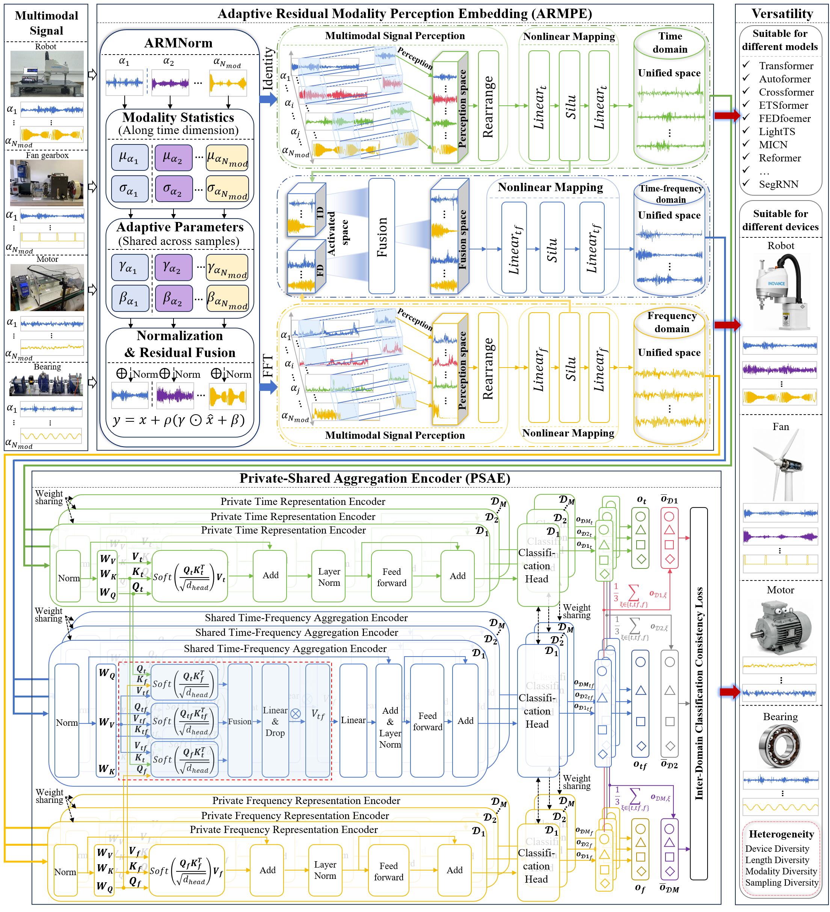
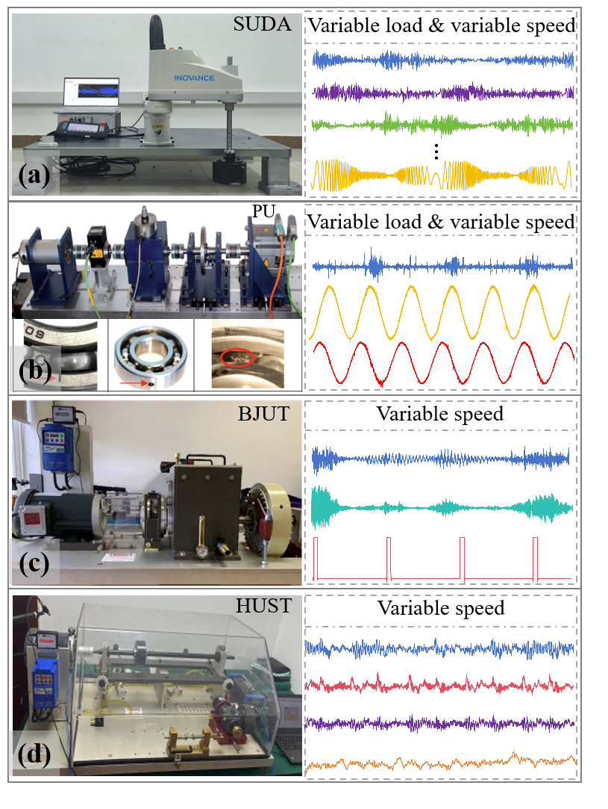

# UPAformer

> **A Universal Perception and Aggregation Transformer for Heterogeneous Multimodal Fault Diagnosis**

This repository contains the PyTorch implementation of **UPAformer**, a unified framework for fault diagnosis across industrial systems with different modality combinations, sampling rates, and signal lengths. The model combines an **Adaptive Residual Modality Perception Embedding (ARMPE)** with a **Private-Shared Aggregation Encoder (PSAE)** to construct and aggregate time, frequency, and time-frequency representations.

## 🧭 Framework

% 


- **ARMNorm** calibrates modality-dependent distributions while retaining the original signal through a residual connection.
- **ARMPE** maps heterogeneous multimodal inputs into unified time, frequency, and time-frequency embeddings.
- **PSAE** models representation-specific information and shared complementary information through private-shared attention.
- A shared classification head produces predictions from the three representation branches.

## 🗂️ Repository Structure


The complete code will be released immediately upon acceptance of the paper.
```text
UPAformer_code/
├── main.py                         # Training, validation, testing, and experiment loops
├── Embedding/
│   └── ARMPE.py                    # ARMNorm and ARMPE
├── models/
│   ├── Diagnositic_model.py        # Diagnostic-model wrapper
│   ├── UPAformer.py                # UPAformer architecture and prediction heads
│   ├── PSAEncoder.py               # Private-Shared Aggregation Encoder
│   └── PSAE_Attention.py           # Private-shared attention operations
├── IDCCLoss/
│   └── loss_calculation.py          # Inter-domain consistency loss
├── data_loader/
│   └── dataloader.py               # Dataset partitioning and batch construction
├── dataset/
│   └── file_path.py                # Dataset paths and transfer-task mapping
├── save_dir/                       # Experimental records and model outputs
└── figs/                           # PNG previews and vector PDF figures
```

## 📊 Datasets

The experiments cover four heterogeneous platforms from **Soochow University (SUDA)**, **Paderborn University (PU)**, **Beijing Jiaotong University (BJUT)**, and **Huazhong University of Science and Technology (HUST)**.




| Dataset | Equipment | Modalities | Modality signals | Signal length | Sampling rate | Health states |
|:--|:--|:--:|:--|--:|--:|:--|
| **SUDA** | SCARA robot ball-screw system | 7 | Current feedback; U-, V-, and W-phase currents; d-axis current feedback; two vibration signals | 1024 | 1.6 kHz | **4:** Healthy; screw-nut jamming; spline-nut jamming; ball loss |
| **PU** | Rolling-bearing test rig | 3 | Two motor-current signals; one vibration signal | 4096 | 64 kHz | **4:** Healthy; outer-race fault; inner-race fault; combined inner-/outer-race fault |
| **BJUT** | Wind-turbine gearbox test rig | 3 | Two vibration signals; one encoder signal | 4096 | 48 kHz | **5:** Healthy; broken tooth; missing tooth; tooth-root crack; wear |
| **HUST** | Motor test rig | 4 | Three vibration signals; one acoustic signal | 2048 | 25.6 kHz | **6:** Healthy; bearing fault; bowed rotor; broken rotor bars; rotor misalignment; voltage unbalance |

1. **SUDA:** Signals were collected under time-varying speeds and four load conditions: 0, 3, 6, and 9 kg.
2. **PU:** Four compound conditions combine different rotational speeds, load torques, and radial forces, as listed below.
3. **BJUT:** Four operating-frequency conditions were considered: 20, 25, 30, and 35 Hz.
4. **HUST:** Four operating-frequency conditions were considered: 5, 10, 20, and 30 Hz.

### Sample Statistics

| Dataset | Health states | Samples per state per condition | Samples per condition | Conditions | Total samples | Source samples per task | Unknown-domain samples per task |
|:--|--:|--:|--:|--:|--:|--:|--:|
| **SUDA** | 4 | 50 | 200 | 4 | **800** | 600 | 200 |
| **PU** | 4 | 61 | 244 | 4 | **976** | 732 | 244 |
| **BJUT** | 5 | 64 | 320 | 4 | **1,280** | 960 | 320 |
| **HUST** | 6 | 80 | 480 | 4 | **1,920** | 1,440 | 480 |

The source-sample count corresponds to the three observed conditions in each leave-one-condition-out task; the remaining condition is used only as the unknown domain.

## 🔧 PU Operating Conditions

In the PU condition codes, `N`, `M`, and `F` denote rotational speed, load torque, and radial force, respectively.

| No. | Condition code | Rotational speed | Load torque | Radial force |
|:--:|:--|--:|--:|--:|
| 0 | `N15_M07_F10` | 1500 rpm | 0.7 N·m | 1000 N |
| 1 | `N09_M07_F10` | 900 rpm | 0.7 N·m | 1000 N |
| 2 | `N15_M01_F10` | 1500 rpm | 0.1 N·m | 1000 N |
| 3 | `N15_M07_F04` | 1500 rpm | 0.7 N·m | 400 N |

## 🔁 Transfer-Task Settings

A leave-one-condition-out domain-generalization protocol was used. For each task, three operating conditions constitute the labeled source domains, while the remaining condition is treated as the unknown domain. Unknown-domain samples are excluded from model optimization and used only for evaluation.

| Dataset | Task | Source domains | Unknown domain |
|:--|:--:|:--|:--|
| SUDA | T0 | 3, 6, and 9 kg | 0 kg |
| SUDA | T3 | 0, 6, and 9 kg | 3 kg |
| SUDA | T6 | 0, 3, and 9 kg | 6 kg |
| SUDA | T9 | 0, 3, and 6 kg | 9 kg |
| PU | T0 | No. 1, No. 2, and No. 3 | No. 0 |
| PU | T1 | No. 0, No. 2, and No. 3 | No. 1 |
| PU | T2 | No. 0, No. 1, and No. 3 | No. 2 |
| PU | T3 | No. 0, No. 1, and No. 2 | No. 3 |
| BJUT | T20 | 25, 30, and 35 Hz | 20 Hz |
| BJUT | T25 | 20, 30, and 35 Hz | 25 Hz |
| BJUT | T30 | 20, 25, and 35 Hz | 30 Hz |
| BJUT | T35 | 20, 25, and 30 Hz | 35 Hz |
| HUST | T5 | 10, 20, and 30 Hz | 5 Hz |
| HUST | T10 | 5, 20, and 30 Hz | 10 Hz |
| HUST | T20 | 5, 10, and 30 Hz | 20 Hz |
| HUST | T30 | 5, 10, and 20 Hz | 30 Hz |

## 🚀 Quick Start

### 1. Create the environment

```bash
python -m venv .venv
```

Activate the environment and install the required packages:

```bash
pip install torch numpy pandas scipy scikit-learn matplotlib einops tqdm
```

CUDA-enabled PyTorch is recommended for reproducing the complete experimental sweep.

### 2. Configure the datasets

Place the prepared datasets under `dataset/` and verify the corresponding roots and task mappings in [`dataset/file_path.py`](dataset/file_path.py). Dataset-specific sampling rates, modality patch sizes, and transfer-task lists are configured near the beginning of [`main.py`](main.py).

### 3. Default Experimental Settings

| Parameter | Default value |
|---|---:|
| Optimizer | Adam |
| Learning rate | 3e-4 |
| Batch size | 32 per source domain |
| Training epochs | 100 |
| Repeated runs | 10 |
| Number of perception kernels | 128 |
| Kernel length | 72 |
| Unified embedding dimension | 160 |
| PSAE layers | 1 |
| Attention heads | 2 |
| Dropout | 0.1 |
| ARMNorm | Enabled |
| ARMNorm residual weight | 0.1 |
| Inter-domain consistency weight | 0.3 |
| Classification head | Shared |
| Final prediction | Average of three branch logits |

The modality width of each perception kernel is dataset dependent:

| Dataset | Total modalities | Modalities per kernel |
|---|---:|---:|
| SUDA | 7 | 6 |
| PU | 3 | 2 |
| BJUT | 3 | 2 |
| HUST | 4 | 3 |


### 4. Run the experiments

From the project root, execute:

```bash
python main.py
```

By default, the script evaluates all four datasets and their leave-one-condition-out tasks. The main defaults are 100 epochs, a batch size of 32, 10 repeated runs, and Adam optimization with a learning rate of `3e-4`.

## 📁 Outputs

Experimental outputs are written to `save_dir/UPAformer/` and include:

- per-run training histories and prediction records;
- task-level mean accuracy, standard deviation, and runtime;
- dataset-level and overall summary files;
- model checkpoints when checkpoint saving is enabled.

## 🔍 Implementation Notes

- Input tensors follow the shape **batch × sequence length × modality**.
- The sampling rate and modality patch size are selected automatically for each dataset in `main.py`.
- UPAformer returns three logits corresponding to the time, time-frequency, and frequency branches.
- The reported final decision is obtained from the configured branch-fusion strategy.
